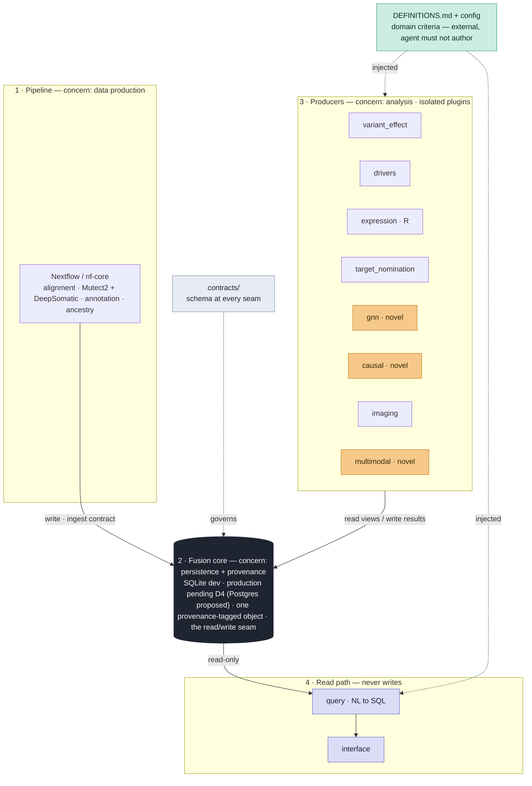
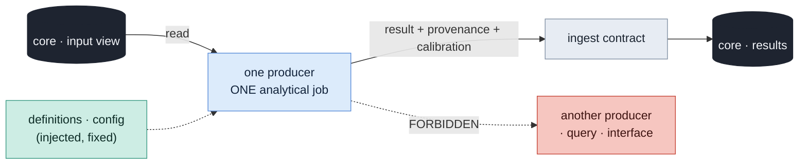

# Architecture — AfriCAN DANCE Insight-Distillation System

> Canonical architecture spec. The coding agent grounds every structural decision here.
> Companion to `docs/build-plan.md`, `docs/risk-and-agent-control.md`, `AGENTS.md`, `DEFINITIONS.md`.

## 1 · Thesis

The value is **not** a set of AI models — it is a **fusion substrate** that joins every modality into one queryable, provenance-tagged object, with fast probabilistic producers feeding it and a grounded query layer reading it. The wet lab is the physical ground truth.

Two layers of trust, and everything hangs off the distinction:

- **Fast / probabilistic** — the pipeline, the producers, the coding agent itself. They propose.
- **Slow / authoritative** — the core (persistence + provenance), the contracts, the gates, and biological validity. They decide.

A prediction is never stored as a fact: it carries its model version, `n`, method, and **calibration status** as first-class fields.

## 2 · Architecture at a glance



The core is the stable center. Everything above it depends **on its contracts, not its internals**. Nothing depends on the interface.

## 3 · The five concerns (bounded contexts)

Each layer owns exactly one concern and talks to its neighbours only through a contract in `contracts/`.

| # | Layer | Owns | May do | May **not** do |
|---|-------|------|--------|----------------|
| 1 | **Pipeline** (`pipeline/`) | Data production | Turn raw sequencing/assay data into standardized outputs; write to core via the ingest contract | Contain analysis or ML logic; know the core's internal schema beyond the contract |
| 2 | **Fusion core** (`core/`) | Persistence + provenance | Hold the canonical data model; enforce provenance + calibration on every write; expose read views | Contain analysis, ML, or presentation logic |
| 3 | **Producers** (`producers/`) | Analysis (one job each) | Read a core view, run one analytical job, emit a provenance-tagged result via the ingest contract | Call another producer; read/write the interface; author domain definitions |
| 4a | **Query** (`query/`) | Read-path translation | Turn a question into schema-validated SQL over core read views; return cited, provenance-linked results | Write to the core; contain domain definitions |
| 4b | **Interface** (`interface/`) | Presentation | Render query results; slice by continuous AFR proportion; encode robust-vs-exploratory | Contain analysis or query logic |

## 4 · Separation-of-concerns principles (binding)

**4.1 · The dependency rule.** Dependencies point *inward*, toward the core's contracts:

```
pipeline ─┐
producers ─┼─► core (contracts) ◄─ query ◄─ interface
           │
        definitions/config ─► (injected into producers and query)
```

- Pipeline and producers depend on the core's **ingest + schema contract**, never its internals.
- Query depends on the core's **read-view contract**. Interface depends on query.
- The core depends on nothing above it. Nothing depends on the interface.
- No layer reaches around a contract. Changing a contract is a deliberate, reviewed act with stated blast radius.

**4.2 · Producers are isolated plugins.** A producer composes with the rest of the system **only through the core**. It never imports, calls, or knows about another producer. This is what lets the fast producers hang off the slow substrate independently — add, remove, or replace one without touching the others.



**4.3 · Write path and read path never cross.** Producers and pipeline **write** to the core; query and interface only **read**. The query layer never writes; a producer never reaches the user through the interface. This keeps the substrate the single source of truth and makes provenance total.

**4.4 · Domain definitions are separated from implementation.** What counts as "ancestry-enriched," "actionable," a significance threshold, or a calibration target lives in `DEFINITIONS.md` + `config/`, owned by domain experts and **injected** into producers and query as fixed input. No producer hardcodes a domain criterion. (This is control **I3** made structural — the agent implements definitions, never authors them.)

**4.5 · Provenance + calibration are one centralized cross-cutting concern.** Every write to the core carries lineage (pipeline version, reference used, sample QC), model version, `n`, method, and **calibration status against the queried population**. This lives in `core/provenance/`, not scattered across producers. A result from an out-of-calibration producer surfaces that caveat wherever it renders — never as a clean number.

**4.6 · Language boundaries are contracts, not leaks.** R (statistical genomics), Python (ML/producers/query), Nextflow (pipeline), SQL (core) exchange data only through the schemas in `contracts/io-contracts/` (Parquet/Arrow). No language reaches into another's runtime; they meet at a file contract.

**Why this maps to the control protocol:** SoC is what makes the gates enforceable. One concern per change = bounded diffs (**G5**). Code lives in the layer that owns its concern = traceability (**I6**). Contracts at every seam = explicit blast radius. Definitions external = **I3**.

## 5 · Module map

> Entries are marked **BUILT** (exists on disk) or **PLANNED** (documented target, not yet created).
> Do not read an unmarked historical copy of this map as current state.

```
africandance/                        # repo root (checkout dir may differ, e.g. Georgetown-Cancer-Research)
├── README.md                        # BUILT
├── ARCHITECTURE.md                  # BUILT — this file
├── AGENTS.md                        # BUILT — agent working rules for this repo
├── DEFINITIONS.md                   # BUILT — domain criteria — owned by domain experts, agent MUST NOT author
├── SPEC.md                          # BUILT — spec-item registry (control I6); new work adds its item BEFORE code
├── AfriCAN_DANCE_Coding_Agent_System_Prompt.md   # BUILT — the operating contract this repo enforces
├── docs/                            # BUILT
│   ├── build-plan.md                # BUILT
│   ├── risk-and-agent-control.md    # BUILT
│   ├── DECISIONS.md                 # BUILT — decision-record log (I4)
│   ├── DEFINITIONS_QUESTIONNAIRE.md # BUILT — domain-owner sign-off instrument for DEFINITIONS.md
│   ├── build-graphs.pdf             # BUILT — design figures (context)
│   ├── map-redrawn.pdf              # BUILT — design figures (context)
│   └── sources/                     # BUILT — canonical PDFs: grant strategy, AI integration, scope of work
│       └── Domestic_Project_Research_Strategy_PF5.txt  # BUILT — dependency-free readable copy of the grant PDF
├── contracts/                       # the seams — schemas & interfaces between layers
│   ├── variant_effect.py            # BUILT — flat contract module (form PROPOSED — see docs/DECISIONS.md D-002)
│   ├── core-schema/                 # PLANNED — fusion-core data model (DDL, provenance + calibration fields)
│   └── io-contracts/                # PLANNED — Parquet/Arrow schemas exchanged R <-> Python <-> pipeline
├── pipeline/                        # 1 · data production (Nextflow / nf-core) — layer dir BUILT (stub), subdirs PLANNED
│   ├── alignment/                   # PLANNED — BWA-MEM2 · GRCh38 + human pangenome
│   ├── calling/                     # PLANNED — Mutect2 + DeepSomatic (concordance logic)
│   ├── annotation/                  # PLANNED — Funcotator
│   └── ancestry/                    # PLANNED — ADMIXTURE + RFMix (continuous AFR)
├── core/                            # 2 · persistence + provenance
│   ├── schema/                      # BUILT — DDL (core/schema/schema.sql); migrations PLANNED
│   ├── ingest/                      # BUILT — adapter: variant_effect output -> core (WRITE path)
│   └── provenance/                  # BUILT — calibration-status + lineage enforcement (cross-cutting, centralized)
├── producers/                       # 3 · analysis — each an ISOLATED plugin, composes only via core
│   ├── variant_effect/              # BUILT — multi-tool consensus VUS reclassification (calibration-flagged; SPEC-002)
│   ├── drivers/                     # PLANNED — IntOGen
│   ├── expression/                  # PLANNED — DESeq2 / GSEA / DoRothEA (R)
│   ├── target_nomination/           # PLANNED — elastic net + random forest
│   ├── gnn/                         # PLANNED — network GNN            (NOVEL — strongest controls)
│   ├── causal/                      # PLANNED — Double ML              (NOVEL — strongest controls)
│   ├── imaging/                     # PLANNED — CellPose + CNN
│   └── multimodal_predictor/        # PLANNED — custom predictor       (NOVEL — strongest controls)
├── query/                           # BUILT (stub README only) — 4a · read path — grounded NL to SQL (never writes)
├── interface/                       # BUILT (stub README only) — 4b · presentation (reads via query; no logic)
├── fixtures/                        # BUILT — golden known-input -> known-output (control G4); variant_effect only so far
├── tests/                           # BUILT — both suites run per AGENTS.md §3
└── config/                          # BUILT — domain criteria JSON (PLACEHOLDER, pending domain sign-off);
                                     #   pinned deps / pipeline versions / reproducibility contract PLANNED
```

**Placement rule:** code goes in the layer that owns its concern, full stop. A variant-calling tweak is `pipeline/calling/`, not wherever it's convenient. Orphan code (no owning layer) fails review.

## 6 · Contracts / the seams

Every boundary in §2 is a named artifact in `contracts/`:

- **core-schema** — the entity + provenance data model. The only thing pipeline and producers may depend on about the core.
- **io-contracts** — the Parquet/Arrow schemas exchanged across language boundaries.
- **read-view contract** — the views the query layer is allowed to read (a stable, curated read surface, decoupled from internal tables).

A contract change is never incidental: it is a reviewed change with its blast radius stated (which layers it touches), because everything downstream depends on it.

## 7 · Cross-cutting concerns

- **Provenance + calibration** — centralized in `core/provenance/`; emitted on every write; surfaced on every read (§4.5).
- **Reproducibility** — pipeline provenance (Nextflow), data versioning (DVC/lakeFS), model registry (MLflow), all pinned in `config/`.
- **Domain definitions** — `DEFINITIONS.md` + `config/`, injected, never hardcoded (§4.4).

## 8 · Architecture-relevant corrections & invariants

These override the source PDFs and are load-bearing for the design:

- Somatic calling uses **DeepSomatic** (not DeepVariant); the high-confidence set is **`Mutect2 ∩ DeepSomatic`**, discordant = investigate. Lives in `pipeline/calling/`.
- **Ancestry is continuous** (ADMIXTURE + RFMix) throughout the analytics. Any continuous→discrete step is its **own explicit component** with its own contract — never an inline collapse to self-reported race.
- **"African ancestry" is not one target.** Calibration, benchmarking, and reporting are **per-population** (Ghanaian / Ethiopian / African American). The core's schema and every producer's calibration field must carry population, not a monolithic "African" flag.
- The system must be able to represent and report **disconfirmation** (e.g., "the ancestry effect is smaller than the pilot suggested") as a first-class result — it is not a confirmation engine.
